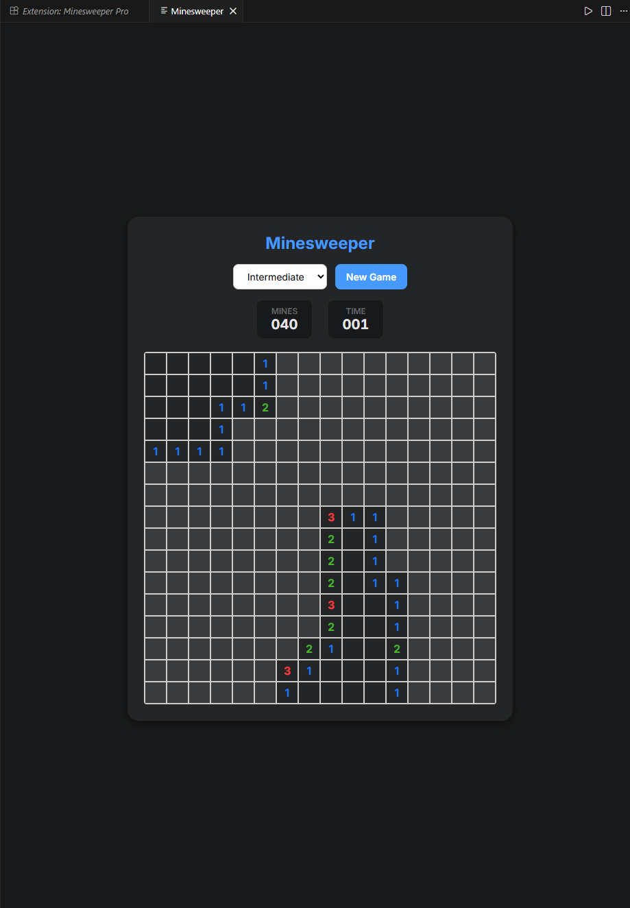

# Minesweeper Pro (ClearBomb)

Play the classic **Minesweeper** game directly inside Visual Studio Code!

This extension brings a modern, beautiful, and logic-focused Minesweeper experience to your editor, perfect for taking a quick break from coding.

## Features

- **🧠 No Guessing Required**: The advanced board generation algorithm ensures **every** game is solvable by logic alone. No more 50/50 blind guesses at the end!
- **🎨 Modern UI & Dark Mode**: Features a clean, premium design that automatically adapts to your VS Code theme (Light/Dark).
- **⚡ Instant Play**: Runs entirely offline within VS Code.
- **🏆 3 Difficulty Levels**:
    - **Beginner**: 9x9, 10 Mines
    - **Intermediate**: 16x16, 40 Mines
    - **Advanced**: 16x30, 99 Mines
- **🖱️ Classic Controls**:
    - **Left Click**: Reveal cell
    - **Right Click**: Flag mine

## How to Use

1.  Open the Command Palette (`Ctrl+Shift+P` / `Cmd+Shift+P`).
2.  Type **"Start Minesweeper"**.
3.  Select the command to open the game tab.

## Improvements

If you find any bugs or have feature requests, please file an issue on [GitHub](https://github.com/Ermaotie/Minesweeper-Pro).

---
---

# Minesweeper Pro (扫雷专家)

在 Visual Studio Code 中直接体验经典的**扫雷**游戏！

这款插件为您带来了现代、美观且注重逻辑的扫雷体验，是您写代码之余放松大脑的完美选择。

## 特性

- **🧠 无需猜雷**: 采用先进的棋盘生成算法，确保**每一局**通过逻辑推理都能解开，告别靠运气的二选一！
- **🎨 现代 UI & 深色模式**: 拥有干净、高级的视觉设计，并能自动适配您的 VS Code 主题（浅色/深色）。
- **⚡ 即开即玩**: 完全离线运行，无需联网。
- **🏆 3 种难度等级**:
    - **初级**: 9x9, 10 雷
    - **中级**: 16x16, 40 雷
    - **高级**: 16x30, 99 雷
- **🖱️ 经典操作**:
    - **左键**: 扫雷
    - **右键**: 插旗

## 如何使用

1.  打开命令面板 (`Ctrl+Shift+P` / `Cmd+Shift+P`)。
2.  输入 **"Start Minesweeper"**。
3.  选择该命令即可打开游戏标签页。

## 问题反馈

如果您发现任何 Bug 或有功能建议，欢迎在 [GitHub](https://github.com/Ermaotie/Minesweeper-Pro) 提交 Issue。

---

**Enjoy your break! / 祝您摸鱼愉快！** 💣
